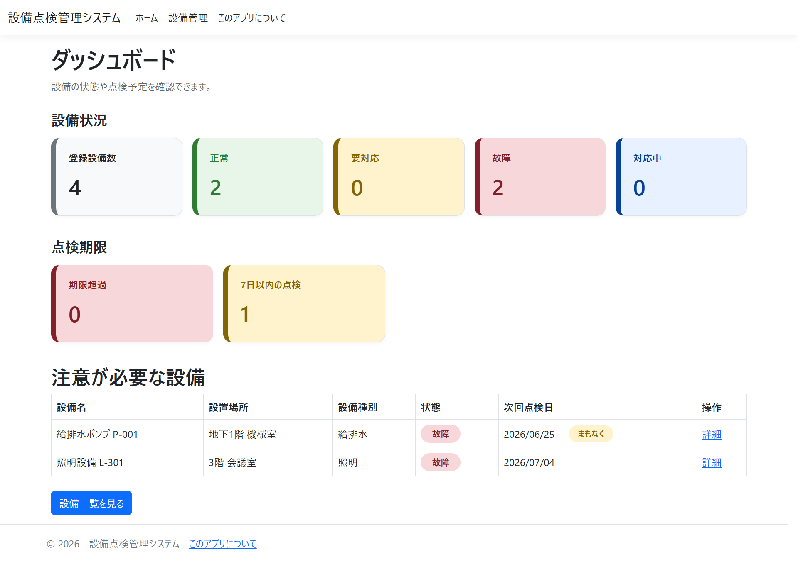

# 設備点検管理システム

> **施設管理の現場を想定した、設備情報・点検履歴・点検期限を管理するWebアプリケーションです。**

設備の登録、編集、削除、検索、点検履歴の登録、状態管理、ダッシュボード表示、CSV出力を行うことができます。

<!--  -->

## 概要

このプロジェクトは、施設管理・保全管理を行う業務システムを想定して開発しました。

建物や施設内の設備情報、点検履歴、次回点検日を管理し、対応が必要な設備を把握しやすくすることを目的としています。

単なるCRUDアプリではなく、点検履歴の登録に応じて設備状態を更新したり、点検期限をもとに対応が必要な設備を抽出したりすることで、実際の施設管理業務に近い流れを意識しています。

### なぜ作ったのか

* 施設管理では、設備情報・点検履歴・点検予定を継続的に管理する必要があるため
* 対応が必要な設備や点検期限が近い設備を、一覧やダッシュボードで把握できるようにしたかったため
* C#、ASP.NET Core MVC、SQL Serverを使用した業務システム開発を実践的に学びたかったため
* Model、Controller、View、ViewModel、DB連携の流れを理解しながら実装したかったため

## 主な機能

* **設備管理**
  設備情報の登録、編集、削除、一覧表示、詳細表示ができます。

* **検索・絞り込み**
  設備名、設置場所、設備種別によるキーワード検索、状態による絞り込み、点検期限による絞り込みができます。

* **点検履歴管理**
  設備ごとに点検履歴を登録できます。点検日、点検結果、点検者、コメント、次回点検予定日を管理できます。

* **設備状態の自動更新**
  点検履歴を登録した際に、点検結果に応じて設備状態を更新します。

* **ダッシュボード**
  登録設備数、状態別件数、期限超過件数、7日以内の点検予定件数、注意が必要な設備一覧を表示します。

* **CSV出力**
  設備一覧をCSV形式で出力できます。検索条件を指定している場合は、条件に一致した設備のみをCSV出力できます。

* **JavaScriptによる操作補助**
  削除処理の前に確認メッセージを表示し、誤操作による削除を防ぎます。

## 技術スタック

| カテゴリ    | 技術                      |
| :------ | :---------------------- |
| 言語      | C#                      |
| フレームワーク | ASP.NET Core MVC        |
| ORM     | Entity Framework Core   |
| データベース  | SQL Server LocalDB      |
| フロントエンド | HTML / CSS / JavaScript |
| UI      | Bootstrap               |
| バージョン管理 | Git / GitHub            |

## アーキテクチャ

```text
[Browser]
    ↓
[View / cshtml]
    ↓
[Controller]
    ↓
[Entity Framework Core]
    ↓
[SQL Server LocalDB]
```

### MVC構成

| 役割         | 内容                                |
| :--------- | :-------------------------------- |
| Model      | 設備情報や点検履歴のデータ構造を定義                |
| View       | cshtmlで画面表示を担当                    |
| Controller | 画面からのリクエストを受け取り、DB操作や画面遷移を制御      |
| ViewModel  | ダッシュボード表示用の集計データを管理               |
| DbContext  | ModelとSQL Serverのテーブルを紐づけ、DB操作を行う |

## DB設計

### Equipments テーブル

設備情報を管理するテーブルです。

| 項目                 | 内容    |
| :----------------- | :---- |
| Id                 | 設備ID  |
| Name               | 設備名   |
| Location           | 設置場所  |
| Category           | 設備種別  |
| Status             | 状態    |
| NextInspectionDate | 次回点検日 |
| Memo               | メモ    |

### Inspections テーブル

設備ごとの点検履歴を管理するテーブルです。

| 項目                 | 内容      |
| :----------------- | :------ |
| Id                 | 点検履歴ID  |
| EquipmentId        | 設備ID    |
| InspectionDate     | 点検日     |
| Result             | 点検結果    |
| Inspector          | 点検者     |
| Comment            | コメント    |
| NextInspectionDate | 次回点検予定日 |

### リレーション

1つの設備に対して、複数の点検履歴を登録できるようにしています。

```text
Equipment 1 : N Inspection
```

## 画面構成

| 画面        | 内容                    |
| :-------- | :-------------------- |
| ダッシュボード   | 設備状況、点検期限、注意が必要な設備を表示 |
| 設備一覧      | 設備の一覧表示、検索、絞り込み、CSV出力 |
| 設備登録      | 新しい設備情報を登録            |
| 設備編集      | 登録済み設備情報を編集           |
| 設備詳細      | 設備情報と点検履歴を表示          |
| 設備削除      | 削除対象の設備を確認して削除        |
| 点検履歴登録    | 設備ごとの点検履歴を登録          |
| このアプリについて | 作成目的、使用技術、機能、工夫点を表示   |


## はじめ方

### 前提条件

* .NET 8 SDK
* SQL Server LocalDB
* Visual Studio 2022 または Visual Studio Code
* Entity Framework Core Tools

Entity Framework Core Toolsが入っていない場合は、以下を実行します。

```bash
dotnet tool install --global dotnet-ef
```

### セットアップ

```bash
# リポジトリをクローン
git clone https://github.com/ryuseitakagi0919/FacilityMaintenanceApp.git

# プロジェクトフォルダへ移動
cd FacilityMaintenanceApp

# パッケージを復元
dotnet restore

# データベースを作成
dotnet ef database update

# アプリを起動
dotnet run
```

起動後、ターミナルに表示されたURLにアクセスします。

```text
https://localhost:xxxx
```

## デモ

スクリーンショットや操作動画は準備中です。

スクリーンショットを追加する場合は、以下のような構成を想定しています。

| 画面      | スクリーンショット                           |
| :------ | :---------------------------------- |
| ダッシュボード | `docs/images/dashboard.png`         |
| 設備一覧    | `docs/images/equipment-list.png`    |
| 設備詳細    | `docs/images/equipment-details.png` |
| 点検履歴登録  | `docs/images/inspection-create.png` |
| CSV出力   | `docs/images/csv-export.png`        |

## 今後追加したい機能

* 修繕履歴の管理
* 設備に関連する図面や資料の添付機能
* 操作ログ機能
* ログイン・権限管理
* 点検予定日の通知機能
* 設備別の点検回数や故障件数のグラフ表示
* CSVインポート機能

## 学習・実装で意識したこと

このアプリでは、ASP.NET Core MVCの基本構成を意識して実装しました。

* Modelで設備情報や点検履歴のデータ構造を定義
* ControllerでDB操作や検索条件の処理を実装
* ViewでModelのデータを表示
* ViewModelでダッシュボード表示用の集計データを管理
* Entity Framework Coreを使用してSQL Serverと接続
* LINQを使用して検索・絞り込み処理を実装
* JavaScriptを使用して削除前の確認処理を実装

業務システムとして、利用者が情報を確認しやすく、対応が必要な設備を見つけやすい画面構成を意識しました。